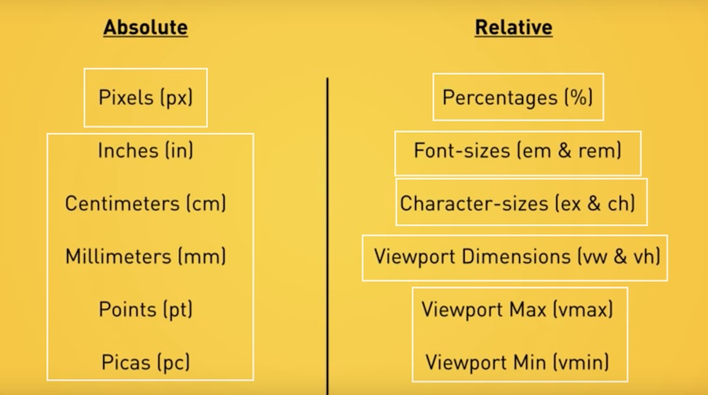

# REM复习与H5手机页面开发

+ REM是相对html元素的大小

## px, em and rem

### em 相对的长度单位
+ em 相对参照物为 父元素 的 font-size (**错，其实是针对当前元素的font-size**)
+ em 具有继承的特点
+ 当没有设置font-size时, 浏览器会有一个默认的em设置: 1em = 16px
**em的缺点: 容易混乱**

### rem的相对参照物为 根元素html
+ 相于参照固定不变所以比较好计算
+ 当没有设置font-size时, 浏览器会有一个默认的rem设置: 1rem = 16px, 这点与em一致

### 常见html设置

+ font-size: 62.5%  --> 1rem = 10px (10/16*100%)
+ font-size: 100%   --> 1rem = 16px

**缺陷: 不是所有浏览器都支持rem的属性**

+ [em VS rem](http://webdesign.tutsplus.com/tutorials/comprehensive-guide-when-to-use-em-vs-rem--cms-23984)
+ [Understanding and using rem](https://www.sitepoint.com/understanding-and-using-rem-units-in-css/)
+ [CSS units in one place](https://www.youtube.com/watch?v=qrduUUdxBSY)
+ [CSS positioning part1](https://www.youtube.com/watch?v=kejG8G0dr5U&list=PLqGj3iMvMa4L731ispRfGAabXeRpM4RL6)
+ [CSS positioning part2](https://www.youtube.com/watch?v=Rf6zAP4YnZA&list=PLqGj3iMvMa4L731ispRfGAabXeRpM4RL6&index=2)
+ [小锋推荐:rem和移动适配](http://div.io/topic/1092)

